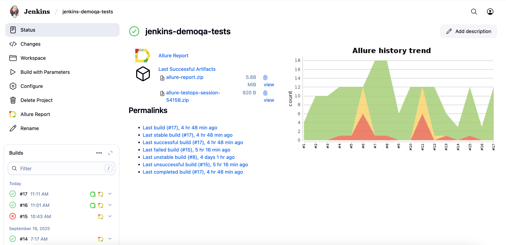

# Проект по автоматизации UI тестирования на DEMOQA
<a href="https://demoqa.com/"></a>

## :point_up: Структура:

- <a href="#point_up_2-технологии-и-инструменты">Стек</a>
- <a href="#point_up_2-проведенные автотесты">Проведенные автотесты</a>
- <a href="#point_up_2-сборка-в-Jenkins">Сборка в Jenkins</a>
- <a href="#point_up_2-запуск-из-терминала">Запуск из терминала</a>
- <a href="#point_up_2-allure-отчет">Allure отчет</a>
- <a href="#point_up_2-интеграция-с-allure-testops">Интеграция с Allure TestOps</a>
- <a href="#point_up_2-интеграция-с-jira">Интеграция с Jira</a>
- <a href="#point_up_2-отчет-в-telegram">Отчет в Telegram</a>
- <a href="#point_up_2-видео-примеры-прохождения-тестов">Видео примеры прохождения тестов</a>

## :point_up_2: Стек
<p align="center">


</p>

## :point_up_2: Проведенные автотесты
- Проверка работы страницы Registration Form
  - Заполнение всех полей
  - Заполнение обязательных полей
  - Отправка пустой формы
- Проверка работы страницы Text Box
  - С помощью случайных значений в полях вода
  - Параметризованные значения
- Параметризированные тесты на авторизацию со страницы Login

## :point_up_2: Сборка в Jenkins
[**Сборка в Jenkins**](https://jenkins.autotests.cloud/job/jenkins-demoqa-tests/)
<p>

</p>

### Параметры сборки в Jenkins:
Сборка в Jenkins

- task (выбор групп тестов)
- webDriverHost (адрес удаленного сервера selenoid)
- browser (браузер, по умолчанию chrome)
- browserVersion (версия браузера, по умолчанию 127)
- browserSize (размер окна браузера, по умолчанию 1920x1080)

## :point_up_2: Запуск из терминала
Локальный запуск:
```
gradle clean demoqa
```
Удаленный запуск:
```
clean 
${TASK} 
-Dbrowser=${BROWSER}
-DbrowserVersion=${BROWSER_VERSION}
-DbrowserSize=${BROWSER_SIZE} 
-DwebDriverHost=${WEB_DRIVER_HOST}
```

## :point_up_2: Allure отчет
- ### Главный экран отчета

- ### Страница с проведенными тестами